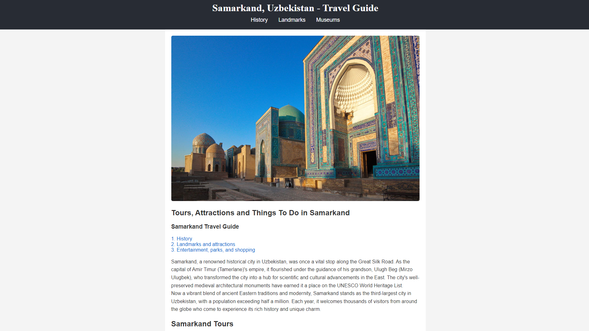
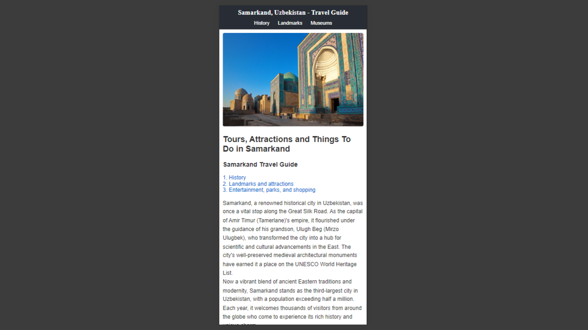

# 🌍 Samarkand Travel Guide

Welcome to the **Samarkand Travel Guide**! This project is a comprehensive guide to exploring the historic city of Samarkand, Uzbekistan. Discover the city's rich history, iconic landmarks, vibrant museums, and much more.

---

## 🖥️ Preview

### 💻 Desktop



### 📱 Mobile



---

## ℹ️ About the Project

The **Samarkand Travel Guide** provides tourists and history enthusiasts with detailed information about Samarkand's most notable sites. The guide includes sections on the city's history, landmarks, museums, tours, and more.

---

## ✨ Features

- ✅ **Responsive Design**: The website is optimized for both desktop and mobile devices.  
- 📚 **Rich Content**: Includes detailed information on Samarkand's history, landmarks, museums, and tours.  
- 🖼️ **Visual Appeal**: Uses high-quality images to showcase the beauty of Samarkand.  
- 🧭 **User-Friendly Navigation**: Easy-to-use navigation links that allow users to quickly access different sections of the guide.

---

## ⚙️ Getting Started

To get a local copy up and running, follow these simple steps:

### 📥 Installation

1. 🔽 **Clone the repo**:

```sh
   git clone https://github.com/iqbolshoh/samarkand-travel-guide.git
```

2. 📁 **Navigate to the project directory**:

   ```sh
   cd samarkand-travel-guide
   ```

3. 🌐 **Open `index.html`** in your web browser to view the guide:

   ```sh
   open index.html
   ```

---

## 🚀 Usage

Simply open the `index.html` file in your web browser to view the travel guide. The site is fully responsive and will adjust based on the screen size of your device.

## 🖥 Technologies Used


## 📜 License
This project is open-source and available under the **MIT License**.

## 🤝 Contributing  
🎯 Contributions are welcome! If you have suggestions or want to enhance the project, feel free to fork the repository and submit a pull request.

## 📬 Connect with Me  
💬 I love meeting new people and discussing tech, business, and creative ideas. Let’s connect! You can reach me on these platforms:

<div align="center">
  <table>
    <tr>
      <td>
        <a href="https://iqbolshoh.uz" target="_blank">
          
        </a>
      </td>
      <td>
        <a href="mailto:iilhomjonov777@gmail.com" target="_blank">
          
        </a>
      </td>
      <td>
        <a href="https://github.com/iqbolshoh" target="_blank">
          
        </a>
      </td>
      <td>
        <a href="https://www.linkedin.com/in/iqbolshoh/" target="_blank">
          
        </a>
      </td>
      <td>
        <a href="https://t.me/iqbolshoh_777" target="_blank">
          
        </a>
      </td>
      <td>
        <a href="https://wa.me/998997799333" target="_blank">
          
        </a>
      </td>
      <td>
        <a href="https://instagram.com/iqbolshoh_777" target="_blank">
          
        </a>
      </td>
      <td>
        <a href="https://x.com/iqbolshoh_777" target="_blank">
          
        </a>
      </td>
      <td>
        <a href="https://www.youtube.com/@Iqbolshoh_777" target="_blank">
          
        </a>
      </td>
    </tr>
  </table>
</div>
