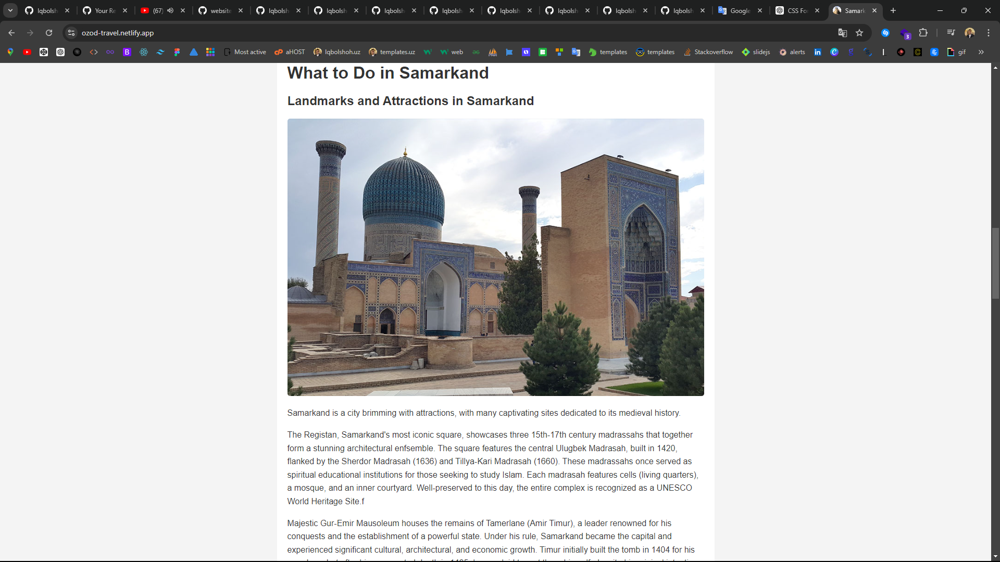

# Samarkand Travel Guide

Welcome to the Samarkand Travel Guide! This project is a comprehensive guide to exploring the historic city of Samarkand, Uzbekistan. Discover the city's rich history, iconic landmarks, vibrant museums, and much more.

## Preview

### Desktop



### Mobile


## Table of Contents

- [About the Project](#about-the-project)
- [Technologies Used](#technologies-used)
- [Features](#features)
- [Getting Started](#getting-started)
- [Usage](#usage)
- [Contributing](#contributing)
- [Contact](#contact)

## About the Project

The Samarkand Travel Guide provides tourists and history enthusiasts with detailed information about Samarkand's most notable sites. The guide includes sections on the city's history, landmarks, museums, tours, and more.


## Features

- **Responsive Design**: The website is optimized for both desktop and mobile devices.
- **Rich Content**: Includes detailed information on Samarkand's history, landmarks, museums, and tours.
- **Visual Appeal**: Uses high-quality images to showcase the beauty of Samarkand.
- **User-Friendly Navigation**: Easy-to-use navigation links that allow users to quickly access different sections of the guide.

## Getting Started

To get a local copy up and running, follow these simple steps:

### Prerequisites

You will need the following installed on your local machine:

- A modern web browser (e.g., Chrome, Firefox)
- A text editor (e.g., VS Code, Sublime Text)

### Installation

1. **Clone the repo**:

   ```sh
   git clone https://github.com/iqbolshoh/samarkand-travel-guide.git
   ```

2. **Navigate to the project directory**:

   ```sh
   cd samarkand-travel-guide
   ```

3. **Open `index.html`** in your web browser to view the guide:

   ```sh
   open index.html
   ```

## Usage

Simply open the `index.html` file in your web browser to view the travel guide. The site is fully responsive and will adjust based on the screen size of your device.

## Contributing

Contributions are what make the open-source community such an amazing place to learn, inspire, and create. Any contributions you make are **greatly appreciated**.

If you have suggestions for improvements, please fork the repo and create a pull request. You can also simply open an issue with the tag "enhancement". Don't forget to give the project a star! Thanks again!

1. Fork the Project
2. Create your Feature Branch (`git checkout -b feature/AmazingFeature`)
3. Commit your Changes (`git commit -m 'Add some AmazingFeature'`)
4. Push to the Branch (`git push origin feature/AmazingFeature`)
5. Open a Pull Request

## Technologies Used

This project is built using the following technologies:

<div style="display: flex; flex-wrap: wrap; gap: 5px;">
    
    
</div>

## Contributing

Feel free to submit pull requests or open issues if you have suggestions for improvements or encounter any problems.

## Connect with Me

I love connecting with new people and exploring new opportunities. Feel free to reach out to me through any of the platforms below:

<table>
    <tr>
        <td>
            <a href="https://github.com/iqbolshoh">
                
            </a>
        </td>
        <td>
            <a href="https://t.me/iqbolshoh_777">
                
            </a>
        </td>
        <td>
            <a href="https://www.linkedin.com/in/iiqbolshoh/">
                
            </a>
        </td>
        <td>
            <a href="https://instagram.com/iqbolshoh_777" target="blank"></a>
        </td>
        <td>
            <a href="https://wa.me/qr/22PVFQSMQQX4F1">
                
            </a>
        </td>
        <td>
            <a href="https://x.com/iqbolshoh_777">
                
            </a>
        </td>
        <td>
            <a href="mailto:iilhomjonov777@gmail.com">
                
            </a>
        </td>
    </tr>
</table>
