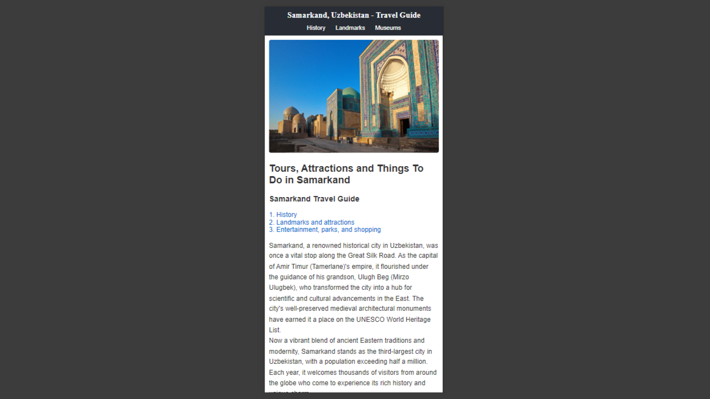

## Samarkand Travel Guide
Explore Samarkand with our comprehensive guide detailing its rich history, iconic landmarks, and vibrant museums. Discover ancient architecture, cultural attractions, and local tours to fully experience the beauty of this historic city.

- **Desktop View:**
  
  

- **Mobile View:**

  

### HTML

1. **Doctype and Structure**: The structure is good. The `<!DOCTYPE html>` declaration and the `<html>`, `<head>`, and `<body>` elements are correctly used.

2. **Meta Tags**: You’ve included the necessary meta tags for character set and viewport, which is great for responsiveness.

3. **Links**: The links to CSS and external fonts are correct. Just make sure the paths to images and CSS files are accurate.

4. **Header and Navigation**:
   - The header and navigation are clear and well-organized. Ensure the IDs used in the navigation links correspond to the sections they refer to.

5. **Content**:
   - The content is informative and structured logically. 
   - Remove duplicate paragraphs to avoid redundancy, especially in the History section.

6. **Image Alt Text**: Make sure each image has a meaningful `alt` attribute to enhance accessibility and SEO.

7. **Footer**: It’s correctly placed and includes a copyright notice.

### CSS

1. **Basic Styles**:
   - Your base styles look good for larger screens. You use the `Roboto` font family, which is clean and readable.

2. **Responsive Design**:
   - Consider adding media queries to adjust styles for different screen sizes. This will improve the user experience on mobile devices.

3. **Header Navigation**:
   - The `header nav a:hover` selector appears incomplete. Ensure it includes style properties like `color` or `background-color` to enhance the hover effect.

4. **Accessibility**:
   - Ensure that text contrasts well with the background color to maintain readability.

5. **CSS File**:
   - It looks like the CSS code is partially included. Ensure the file is complete and saved correctly.

